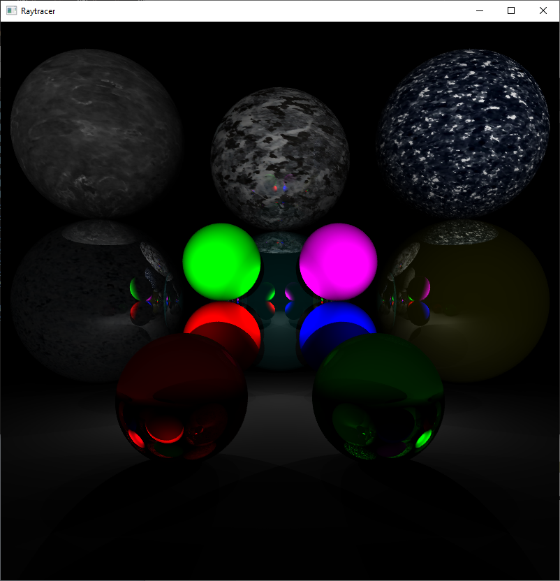

# C++ Multithreaded Raytracer

A raytracer, which allows for rendering planes and (textured) spheres with lambertian, dielectric and metal materials in C++ using SDL2 and C++11's std::threads.

Note: This raytracer uses CPU processing power, not GPU.

## Usage
The executable for the Raytracer can be found in the bin folder.

Clicking on the SDL2 window while the program is ray tracing will freeze it, please be aware. :)

## Evaluation
An evaluation of this raytracer can be watched on YouTube by clicking [here](https://youtu.be/vtdITwPY7Qg).
